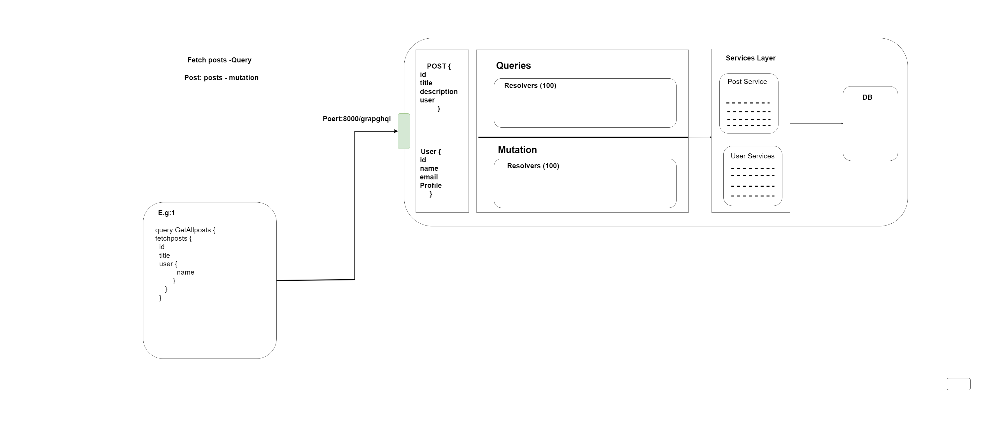

# GraphQL Backend

This repository contains the GraphQL backend for Blog app. Below is the architectural diagram explaining the structure and flow:

GraphQL Blog Application
This repository contains the backend implementation for a Blog application leveraging the power of GraphQL APIs. Designed as a learning project, it serves as a demonstration of the capabilities and flexibility of GraphQL in building modern web applications.

Features
GraphQL API: The core of this project is a GraphQL API, which provides an efficient, flexible, and powerful alternative to the REST API.

Authentication: Secure user registration and login functionality are implemented, ensuring that only authenticated users can access specific functionalities.

Authorization: Role-based authorization is built-in, ensuring that users can only perform actions they are permitted to, such as editing or deleting their own blog posts.

Blog Functionalities: Users can create, edit, and delete blog posts, as well as view posts from other users.

Motivation
The primary motivation behind this project is to learn and understand GraphQL and its integration with modern web technologies. Through the creation of this Blog application, I've gained insights into the nuances of GraphQL, including queries, mutations, and subscriptions, as well as the intricacies of integrating authentication and authorization.

Future Enhancements
While this project serves as a starting point and a learning experience, there's always room for improvement. Future iterations may include:

Implementing a frontend to interact with the GraphQL API seamlessly.
Integrating advanced features such as post comments, likes, and sharing functionalities.
Performance optimizations and scaling strategies.
Conclusion
This project has been an enlightening journey into the world of GraphQL, and I hope it serves as a reference or starting point for others embarking on a similar path.

